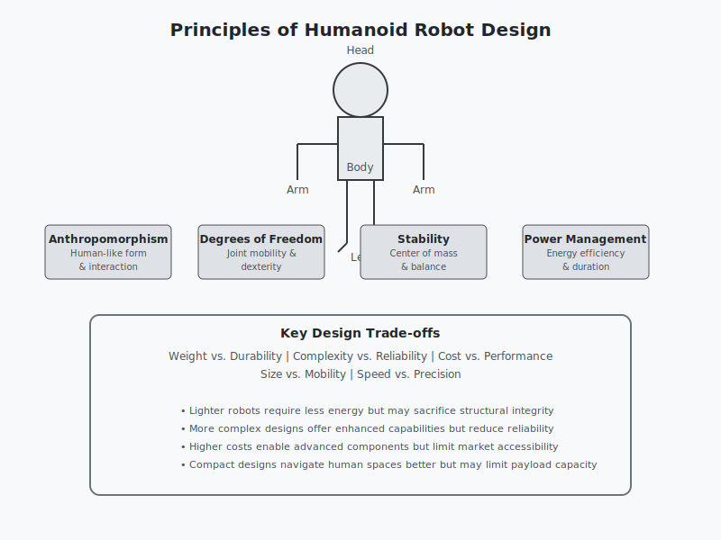

# Lesson 2.1: Physical Design of Humanoid Robots

## Learning Objectives

By the end of this lesson, you will be able to:
- Identify key design considerations for humanoid robots
- Compare different humanoid robot designs
- Understand trade-offs in physical design
- Analyze design methodologies used in humanoid robotics
- Evaluate design constraints and requirements

## Introduction

Humanoid robots represent a fascinating intersection of mechanical engineering, electronics, and artificial intelligence. Their physical design is crucial to their functionality, performance, and ultimate success in performing human-like tasks. The physical architecture of a humanoid robot encompasses multiple subsystems that must work in harmony to achieve the intended functionality.

This lesson explores the fundamental principles and considerations involved in designing humanoid robots, covering everything from basic structural decisions to complex actuation and sensing systems. Understanding these design principles is essential for developing effective humanoid robots that can interact with human environments and perform meaningful tasks.

## Key Design Considerations for Humanoid Robots

Designing a humanoid robot involves numerous complex trade-offs and considerations that significantly impact the robot's performance, capabilities, and practical applications. Here are the critical factors that engineers must evaluate:

### Anthropomorphism vs. Functional Efficiency

The balance between human-like appearance and functional efficiency presents a fundamental design challenge. While anthropomorphic features can improve human-robot interaction, they may compromise functionality. Engineers must determine the optimal level of human similarity based on the robot's intended use cases.

### Degrees of Freedom (DOF)

The number and placement of joints directly affect the robot's mobility and dexterity. More degrees of freedom increase complexity and cost but provide greater flexibility in movement. Designers must strategically allocate DOF based on specific task requirements.

### Center of Mass and Stability

Maintaining balance is crucial for humanoid robots due to their inherently unstable configuration. The center of mass must be carefully managed through weight distribution, actuator placement, and control algorithms to ensure stable locomotion.

### Power and Energy Management

Power consumption significantly impacts operational duration and system design. Efficient power management requires optimizing component selection, energy storage, and motion planning to maximize performance while maintaining reasonable battery life.

### Structural Materials

Material selection affects strength, weight, durability, and cost. Modern humanoid robots often use combinations of lightweight metals, composites, and polymers to achieve the right balance of properties.

### Environmental Robustness

Robots must withstand various environmental conditions including temperature variations, humidity, dust, and physical impacts. The design must account for these factors to ensure reliable operation in real-world scenarios.

## Comparing Different Humanoid Robot Designs

The field of humanoid robotics has produced several notable designs, each with distinct advantages and limitations. Understanding these differences illuminates the trade-offs inherent in physical design decisions.

### ASIMO by Honda

ASIMO represents one of the most recognizable humanoid robots, emphasizing smooth bipedal walking and human interaction. Its design prioritizes stable locomotion and social interaction capabilities. Key features include:

- Height of 130 cm and weight of 48 kg
- Advanced autonomous behavior including obstacle avoidance
- Multiple sensors for environmental awareness
- Human-friendly design for interaction

### Atlas by Boston Dynamics

Atlas focuses on dynamic mobility and manipulation capabilities in challenging environments. Its design emphasizes agility and robustness in complex terrains:

- Height of 5 feet and weighs 180 pounds
- Electric and hydraulic actuators for precise control
- Advanced control algorithms for dynamic movements
- Designed for operation in rough terrain

### NAO by SoftBank Robotics

NAO serves as a platform for research, education, and entertainment. Its compact size and versatility have made it popular in academic settings:

- Height of 58 cm and weighs 5.2 kg
- 25 degrees of freedom
- Multiple sensors including cameras and microphones
- Programmable for various applications

### Pepper by SoftBank Robotics

Pepper focuses on emotional interaction and customer service applications:

- Height of 120 cm and weighs 28 kg
- Emotional recognition capabilities
- Designed for commercial environments
- Interactive touchscreen for enhanced communication

Each design reflects specific priorities and target applications, demonstrating how use cases drive physical design decisions.

## Understanding Trade-offs in Physical Design

Every design decision in humanoid robotics involves trade-offs between competing requirements. Engineers must carefully evaluate these trade-offs to optimize overall system performance.

### Weight vs. Durability

Lighter robots generally require less energy for movement and are safer in human environments, but heavier construction often provides greater durability and protection against impacts. The optimal choice depends on the operational requirements and environment.

### Complexity vs. Reliability

More complex designs with numerous actuators and sensors can provide superior functionality but may reduce reliability due to increased failure points. Simplified designs may be more robust but limit the robot's capabilities.

### Cost vs. Performance

Advanced materials, precision components, and sophisticated control systems increase costs but enhance performance. Designers must balance budget constraints with performance requirements to create viable commercial solutions.

### Size vs. Mobility

Larger robots can carry more powerful components and batteries, but they face challenges in navigating human spaces. Compact designs are more versatile in terms of space but may sacrifice payload capacity and operational time.

### Speed vs. Precision

Fast movement typically requires more energy and generates greater forces that can affect precision. Balancing speed and precision is critical for applications requiring fine manipulation.

## Design Methodologies for Humanoid Robots

Developing humanoid robots requires structured approaches that address the complexity of these systems. Several methodologies have emerged to guide the design process:

### Iterative Design Process

Modern humanoid robot development employs iterative design cycles with rapid prototyping and testing. This approach allows designers to validate concepts early and refine approaches based on empirical results.

### Biomimetic Design

Many humanoid robots incorporate biological inspiration to achieve efficient movement and functionality. This methodology studies human anatomy and physiology to guide mechanical design decisions.

### Modularity Approach

Modular design enables easier maintenance, upgrades, and customization. Components can be standardized and replaced independently, reducing development and operational costs.

### System Integration Focus

Given the complexity of humanoid robots, successful designs prioritize seamless integration of mechanical, electrical, and software systems from the initial design phase.

## Design Constraints and Requirements

Humanoid robot design is subject to numerous constraints that must be met to ensure viability:

### Physical Constraints

- Dimensions must allow navigation in human environments
- Weight limits for portability and safety
- Strength requirements for intended tasks
- Structural integrity under operational loads

### Regulatory Requirements

- Compliance with safety standards
- Electromagnetic compatibility
- Environmental regulations
- International certification requirements

### Performance Requirements

- Desired range of motion
- Maximum speeds and accelerations
- Payload capacity
- Operational lifetime

### Economic Constraints

- Development budget limitations
- Target production costs
- Market price points
- Service and maintenance expenses

## Summary

The physical design of humanoid robots involves complex decisions that balance multiple competing factors. From selecting appropriate materials to determining the optimal number of degrees of freedom, each choice significantly impacts the robot's performance, cost, and usability. Successful designs emerge from careful consideration of trade-offs, systematic design methodologies, and a deep understanding of the intended applications.

Understanding these design principles is crucial for anyone involved in humanoid robotics, whether as a designer, researcher, or user. As the field continues to evolve, these fundamental principles will continue to guide the development of increasingly capable and practical humanoid robots.

## Visualizing Humanoid Design Principles

The above diagram visually represents the key design principles we've discussed, showing the humanoid robot structure alongside the primary design considerations and trade-offs that engineers must balance.

## Exercises

1. Compare the design approaches of three different humanoid robots of your choosing, identifying the key trade-offs that influenced their physical characteristics.

2. Design a conceptual humanoid robot for a specific application (e.g., household assistance, industrial work, healthcare). Outline the key design considerations and justify your choices based on the application requirements.

3. Evaluate the impact of increasing the number of degrees of freedom in a humanoid robot. Discuss both the benefits and challenges of adding additional joints and actuators.

4. Research an emerging material technology that could impact humanoid robot design. Explain how this innovation might influence future design decisions.